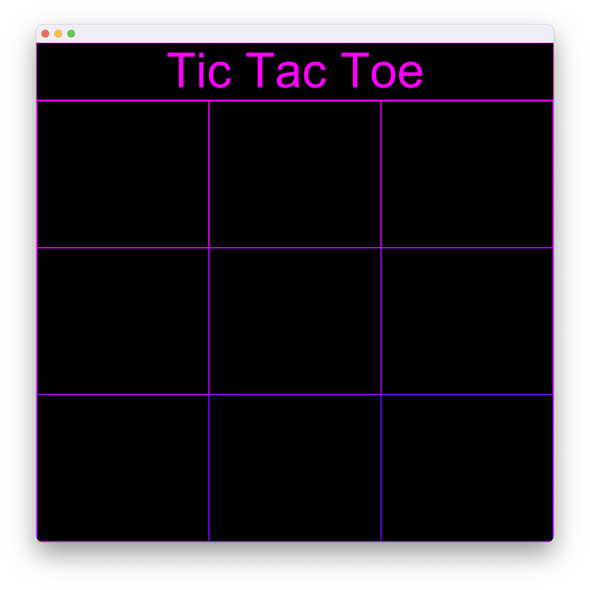
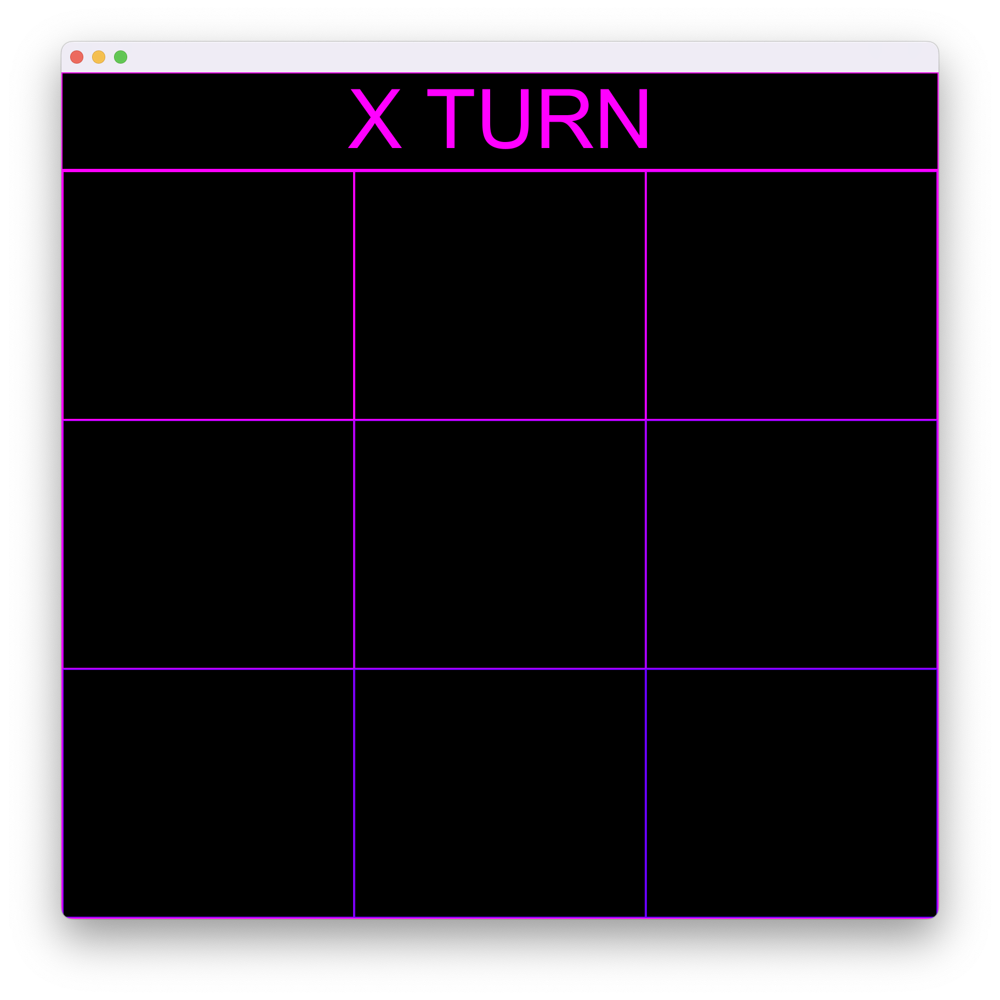
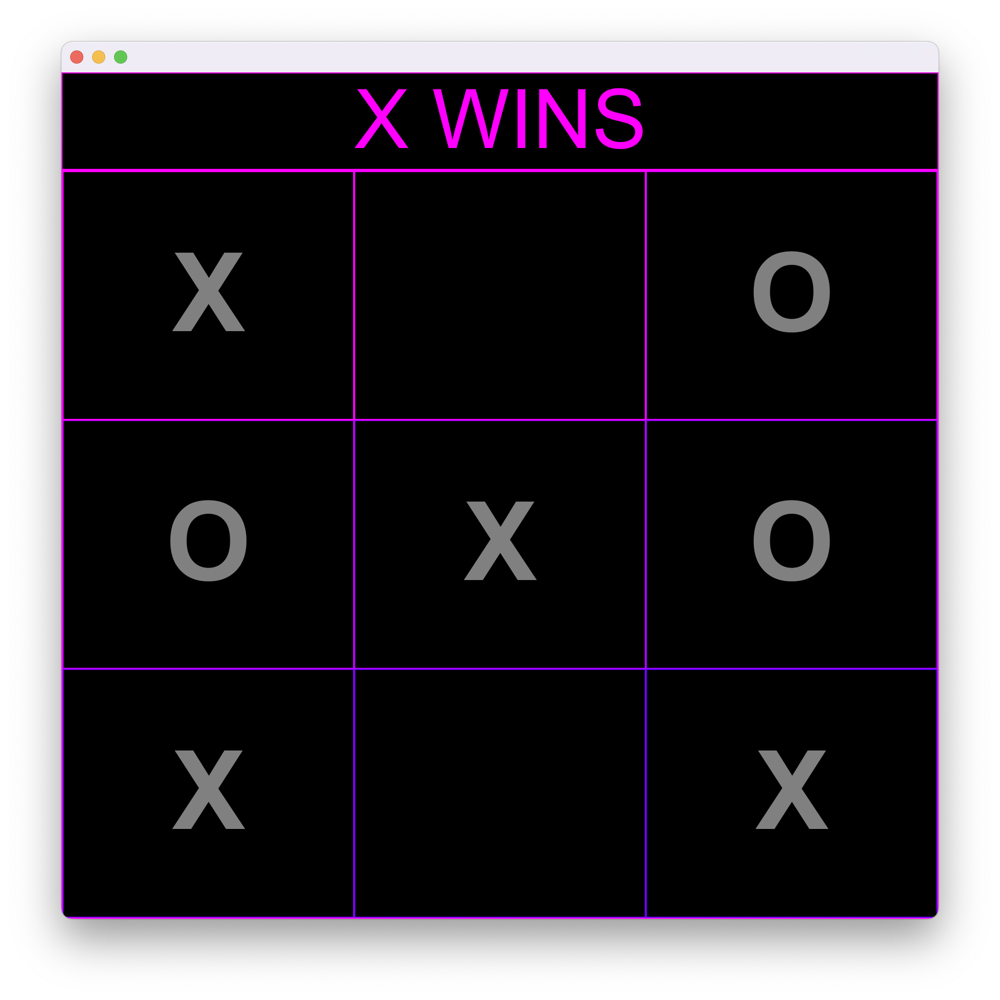

# TicTacToe Game With Java's GUI

The following is the code for a tic tac toe game that was done in Winter 2021. Everything happens in the TicTacToe class and the driver is just to create an instance of that class which basically initiates the program. This is a simple version of the game and was made to build more familiarity with java's GUI, so the program ends at the end of a round while displaying the winner ID (X or O). In order to play again, you need to close the GUI window and run the code again.

## How the game looks like:

### Game launch:

### Game starts (Random player selection): 

### Game ends (Winner announecement):

